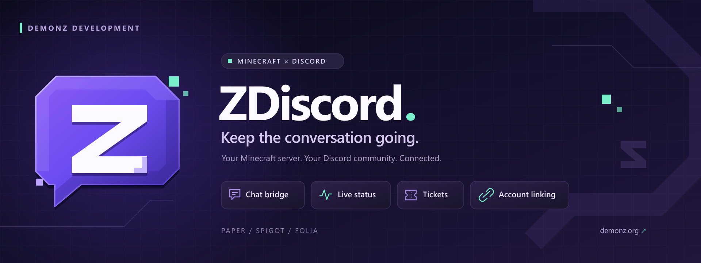

<div align="center">



# ZDiscord

Discord integration for Minecraft servers.

[Releases](https://github.com/DemonZ-Development/ZDiscord/releases) · [Wiki](https://github.com/DemonZ-Development/ZDiscord/wiki) · [Issues](https://github.com/DemonZ-Development/ZDiscord/issues) · [Website](https://demonz.org)

</div>

---

## What it does

ZDiscord connects your Minecraft server to Discord. Chat flows both ways, players see server status without leaving Discord, and staff manage tickets from a dropdown panel.

## Why ZDiscord?

| | ZDiscord | DiscordSRV |
|---|---|---|
| **Slash commands** | Native JDA 6 slash commands + buttons | Bolted-on text commands |
| **Folia support** | Built-in regionized multithreading | No Folia support |
| **Modular design** | 16+ toggleable modules | Chat bridge only |
| **Account linking** | One-time codes + role grants | Clunky multi-step process |
| **Ticket system** | Built-in dropdown panel with categories | Requires separate plugin |
| **Config migration** | Automatic schema upgrades | Manual editing |
| **Webhook handling** | Rate-limited queue with retry | Rate limit issues under load |
| **Message delivery** | Async with a bounded relay queue | Can drop messages |

## Features

- **Chat bridge** — Two-way chat between Minecraft and Discord. Webhooks display player heads as avatars. Linked players show their Discord name and avatar.
- **Server status** — One Discord message that auto-updates with player count, TPS, and memory usage.
- **Live stats panel** — A single auto-updating embed combining players online, performance, and the current top players.
- **Console streaming** — Server log lines forwarded to a Discord channel.
- **Account linking** — One-time codes link Discord and Minecraft accounts. Enforce link-to-join if you want.
- **Staff chat** — `/sc` toggles a staff-only channel bridged to Discord.
- **Tickets** — Players open private support channels via a Discord button or `/ticket`.
- **Leaderboards** — Kills, deaths, and playtime ranked via `/leaderboard`. Replies auto-refresh with live data; a panel channel updates itself continuously.
- **Event messages** — Joins, quits, deaths, and advancements posted to Discord.
- **Performance monitor** — TPS and memory tracked over time with configurable alerts.
- **Anti-raid** — Mass-join detection with optional automatic lockdown.
- **Command logger** — Watched and critical commands posted to a staff channel.
- **Voice status** — Linked players get a tab-list indicator while in a tracked Discord voice channel.
- **Reaction roles** — Map message reactions to Discord roles and in-game permissions.
- **Player profiles** — `/profile [player]` renders a rich embed with avatar, NameMC link, stats, and a follow button.
- **Follow system** — Follow players to get DM notifications when they join. `/following` and `/unfollow` manage subscriptions.
- **Anonymous confessions** — `/confess` posts to a dedicated channel with rate limiting and configurable appearance.
- **CraftyAI assistant** — Query your CraftyAI instance directly from Discord with `/crafty`, featuring private replies, role restrictions, and rate limits.
- **Setup wizard** — `/setup` configures channels from Discord with dropdowns and buttons.
- **DemonZ integrations** — Optional Onlysleep sleep/night messages and RedstoneReboot restart alerts share the events channel (or dedicated channels).
- **SkinsRestorer avatars** — Player cards and chat webhooks use the active restored skin when available, with safe Java/Bedrock fallbacks.
- **Halloween event** — A configurable seasonal mob hunt with personal points, standings, milestones, and finale rewards. Choose eligible worlds, mob types, game modes, and timezone. Optional titles, particles, and ambient sounds are disabled by default. Scores survive restarts; disable the entire event with `halloween.enabled: false`.

Tickets close automatically after `tickets.auto-close-hours` without a message, including time spent offline. The check runs every minute; set the value to `0` to disable it. Staff claims are saved in the selected storage backend and survive restarts; another staff member cannot replace an existing claim. Closing or externally deleting a ticket clears its claim. Transcript exports include the latest message and page through all available history in chronological order, including attachment links and embed content. Large exports are split into upload-sized Markdown files. Deleted messages and expired attachment downloads cannot be recovered.

Configure reaction roles in `reaction-roles.mappings` using `message-id`, `emoji`, `role-id`, and optional `minecraft-permission` (`permission` is also accepted). Unicode and Discord custom emoji notation are supported. Minecraft permission changes require a linked account and LuckPerms. These entries override matching legacy `reaction_roles.yml` entries; configuration reloads apply additions and removals without copying config entries into that legacy file.

Discord attachments appear as individual clickable Minecraft links. `chat.attachment-text` can include `%filename%`. Status panels use `status.embed.title` and the configured color while healthy, with warning/critical/offline colors taking precedence. Join and quit embeds use their configured message templates, including `%player%`, `%online%`, `%previous_online%`, and `%max_players%`.

## Requirements

- Java 17 or newer
- Paper 1.20.4 or newer, Folia, or Spigot 1.20.4 or newer
- A Discord bot token with **Server Members** and **Message Content** intents enabled
- MySQL 8.0 or newer when using the optional MySQL storage backend (the JDBC driver is bundled)

## Installation

1. Download `ZDiscord-1.5.0.jar` from the [Releases](https://github.com/DemonZ-Development/ZDiscord/releases) page.
2. Place the JAR in your server's `plugins/` directory.
3. Start the server to generate the default `config.yml` and `messages.yml`.
4. Open `plugins/ZDiscord/config.yml` and set:
   - `bot.token` — your bot token
   - `bot.guild-id` — your Discord server ID
   - `channels.chat` — the channel ID for chat bridge
5. Restart the server.
6. Run `/setup` in Discord to configure the remaining channels.

## Configuration

All configuration lives in `plugins/ZDiscord/config.yml`. Summary of major sections:

| Section | Purpose |
|---|---|
| `storage` | YAML or MySQL backend for persistent data |
| `bot` | Bot token, activity, and target guild |
| `channels` | Discord channel IDs for each module |
| `chat` | Chat bridge formatting and webhook options |
| `events` | Join, quit, death, and advancement messages |
| `status` | Server status embed |
| `leaderboard` | Tracked stats and top count |
| `linking` | Account linking, optional enforcement, and reward commands |
| `anti-raid` | Mass-join thresholds and lockdown behaviour |
| `performance` | TPS and memory alert thresholds |
| `tickets` | Categories, panel appearance, support roles |
| `confessions` | Confession channel, cooldown, and color |
| `halloween` | Seasonal calendar, hunting rules, cosmetics, broadcasts, standings, and rewards |
| `follow` | Enable/disable follow features |
| `command-logger` | Watched and critical commands |
| `staff-chat`, `voice-status` | Staff chat bridge and voice status indicator |
| `misc` | Update checks, invite link, console role |
| `integrations` | Optional Onlysleep and RedstoneReboot message bridges |

User-facing strings live in `messages.yml`. They accept `&` colour codes and the `%prefix%` placeholder.

### Halloween event

Set `halloween.enabled: false` to disable the entire seasonal module, then run `/zdiscord reload`. Existing scores are retained while disabled. When enabled, the event runs only between `window-start` and `window-end` (`MM-DD`, both inclusive). A date range can span New Year. Set `timezone` to `server` or an IANA name such as `Europe/London` so the calendar follows your community's timezone.

The default hunt counts hostile mobs and bosses killed by players outside Creative and Spectator mode. PvP never awards points. Use `hunting.worlds` to restrict worlds and `hunting.mob-types` to choose exact Bukkit entity types; empty lists use the defaults. Spawner mobs are excluded unless `hunting.count-spawner-mobs` is enabled. Normal eligible mobs award one point, while bosses award `boss-multiplier` points. Scores and milestone thresholds are measured in points.

The default style uses an orange Discord accent (`halloween.color: "#E67E22"`), concise headings, and numbered standings. Customize Minecraft greetings, titles, broadcasts, command replies, and Discord templates through the `halloween-*` entries in `messages.yml`. Set `cosmetics.enabled: true` to opt into a join title, ambient sound, and milestone particles. Titles and milestone effects have independent switches; sound, volume, pitch, particle type, and particle count are configurable.

Discord announcements use `halloween.channel`, falling back to `channels.events`. The Discord connection is optional for the Minecraft hunt. `announce-open`, `announce-finale`, `countdown.enabled`, and `live-panel.enabled` control those features separately. `countdown.days: 0` disables the countdown. `broadcasts.enabled: false` silences public Minecraft announcements while keeping Discord announcements and private join greetings available. `greet-players: false` disables greeting text; opted-in cosmetics are controlled separately. Standings use `top-n`, capped at 25 entries.

At the end of the window, `rewards.winner` console commands apply to first place, and `rewards.participant` commands apply to every player with a positive score, including the winner. Both support `%player%` and `%uuid%`. Empty command lists disable payouts.

Finale markers prevent repeated payouts after ordinary reloads and graceful restarts, including recovery after the server was offline at the end of the hunt. Storage writes are buffered, so an abrupt process crash cannot guarantee atomic persistence of both the claim marker and external reward commands.

Players can use `/zdiscord halloween` to see the event's state, date, and their own score, or `/zdiscord halloween top` for standings. `zdiscord.halloween` is granted to players by default. The commands also work from the server console, which omits a personal score.

## Commands

### In-game

| Command | Permission | Description |
|---|---|---|
| `/zdiscord reload` | `zdiscord.admin` | Reload configuration |
| `/zdiscord status` | `zdiscord.admin` | Show bot and platform status |
| `/zdiscord diagnostics` | `zdiscord.admin` | Show storage, Discord, skin, platform, and module health |
| `/zdiscord link` / `/link` | `zdiscord.link` | Generate a link code |
| `/zdiscord embed <title> <description>` | `zdiscord.embed` | Send a custom embed |
| `/zdiscord ticket <subject>` | `zdiscord.ticket` | Open a support ticket |
| `/zdiscord halloween [status\|top]` | `zdiscord.halloween` | Show the event state, personal points, or standings |
| `/zdiscord panel` | `zdiscord.admin` | (Re)post the ticket panel |
| `/zdiscord lockdown` | `zdiscord.admin` | Toggle anti-raid lockdown |
| `/zdiscord update [check\|dismiss]` | `zdiscord.admin` | Manual update check / dismiss banner |
| `/zdiscord dump` | `zdiscord.admin` | Write a diagnostics file |
| `/discord` | `zdiscord.discord` | Show the Discord invite link |
| `/sc [message]` | `zdiscord.staffchat` | Send to staff chat (toggle with no message) |
| `/confess <message>` | `zdiscord.confess` | Post an anonymous confession |

### Discord slash commands

| Command | Description |
|---|---|
| `/status` | Server status |
| `/players` | Online players |
| `/tps` | Server performance |
| `/link <code>` | Link a Discord account to a Minecraft account |
| `/ticket <subject>` | Open a support ticket |
| `/panel` | (Re)post the ticket panel (admin) |
| `/leaderboard <stat>` | View kills, deaths, or playtime leaderboard |
| `/profile [player]` | Player profile card with stats and follow button |
| `/seen <player>` | Quick last-seen lookup |
| `/following` | List players you follow |
| `/unfollow <player>` | Stop following a player |
| `/confess <message>` | Post an anonymous confession |
| `/halloween` | Halloween event status and current standings |
| `/crafty <question>` | Ask a question via CraftyAI |
| `/setup` | Open the setup wizard |

## Building

```bash
git clone https://github.com/DemonZ-Development/ZDiscord.git
cd ZDiscord
mvn clean package
```

The shaded JAR is written to `target/ZDiscord-1.5.0.jar`.

## Developer API

Other Bukkit plugins can obtain `ZDiscordAPI` through Bukkit's services manager
or `ZDiscordProvider.get()`. In 1.3.0 the API can also queue plain messages and
rich `EmbedData` objects to any configured Discord channel path. ZDiscord itself
uses the same connection for the optional Onlysleep and RedstoneReboot bridges.

## License

Apache License 2.0 — see [LICENSE](LICENSE).

Made by [**DemonZ Development**](https://demonz.org)
